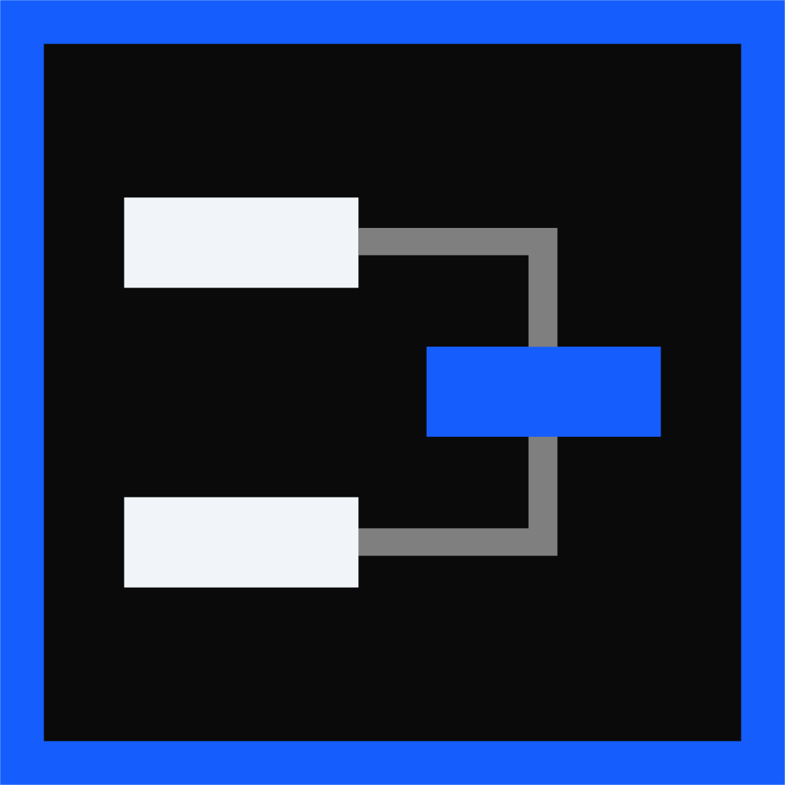
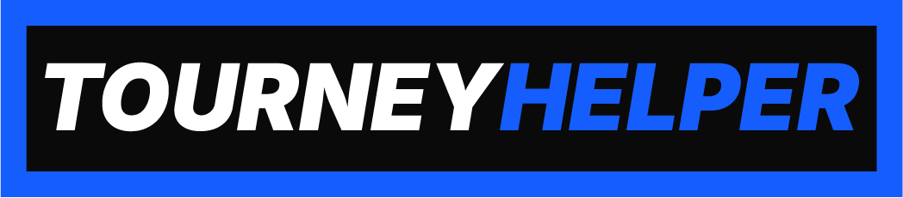

<h4 align="center">🌐<a href="/README.md">English</a> | <a href="/README-RU.md">Русский</a>

<p align="center">  </p>
<p align="center">  </p>

<p align="center">
    <b> Программное обеспечение для автоматизации управления турнирами и общения с участниками. </b>
</p>
<p align="center">
    <a href="https://pkg.go.dev/github.com/dreamervulpi/tourney-helper"></a>
    <a href="https://github.com/DreamerVulpi/tourney-helper/releases">
        
    </a>
    <a href="./LICENSE"></a>
    <a href="https://github.com/DreamerVulpi/tourney-helper/issues"></a>
</p>
<p align="center">
    <a href="https://new.donatepay.ru/@dreamervulpi"></a>
    <a href="https://ko-fi.com/dreamervulpi"></a>
    <a href="https://boosty.to/dreamervulpi"></a>
</p>

## 💡 Особенности

### На текущей версии ```0.4.0```

### 📨 Автоматическиая система уведомлений участников турнира
* Поддержка получения данных с турнирной платформы [start.gg](https://www.start.gg/);
* Поддержка рассылки в мессенджере [Discord](https://discord.com/);
* Поддержка турниров по играм: Tekken 8 и Street Fighter 6;
* Поддержка типов турниров: Одиночный (1 против 1);
* Поддержка форматов турниров: Single | Double Elumination (до одного | двух поражений);
* Рассылка происходит 1 раз в 5 минут;
* Cкорость рассылки составляет ```50-60 игроков за ~ 1 минуту*``` с поиском игроков и сохранением в локальную базу данных.
    * *в зависимости от стабильности соединения вашего устройства с платформами;
* Во время рассылки отображается мониторинг:
    * нагрузки с показателями запросов в секунду/минуту каждой платформы;
    * время (мс) на каждый запрос;
    * время (мс) до конца цикла рассылки, которое рассчитывается напрямую и совпадает с реальной работой;
* Система понимает:
    * кому рассылать уведомления на основе данных с турнирной сетки и своей локальной базы данных;
    * на каком языке направлять сообщения игроку (по стандарту - английский язык, но есть возможность выбрать русский язык. ID роли потребуются в случаях если в вашем мероприятии участвуют игроки разговаривающие на разных языках);
    * какие бои проводятся самостоятельно игроками, а какие будут на прямую трансляцию - присылаются соответсвующие сообщения;
* Благодаря боту в системе уведомлений присутсвует возможность получить контакт игрока напрямую с локального хранилища через мессенджер командой: ```/контакт [игровой_никнейм] [название_игры]```

### 🗃️ Локальная база данных игроков
* Встроенный поиск по игровым никнеймам, логинам контактов или региону;
* Автоматическое добавление игроков в базу данных из найденных результатов системы уведомлений;
* Возможность добавлять вручную или файлами формата csv или json (по шаблону) в базу данных или бан-лист;
* Возможность одним кликом скопировать данные контакта одного игрока в текстовом формате для отправки кому-либо;
* Полный контроль над данными: Создание, редактирование, удаление, бан, разбан пользователей;
* Поддержка своей рейтинговой лиги с возможностью сбросить рейтинг у всех игроков лишь одной кнопкой;
* Поддержка бан-листа с автоматической очисткой банов по истечению срока;

## 🚀 Как начать пользоваться?
1. Скачать архив актуальной программы из вкладки "Релизы".
2. Распаковать в удобную папку.
3. Запустить ```TourneyHelper.exe```
<p>
   Необходимые инструкции и подсказки с описанием присутсвуют в самой программе при нажатии на кнопку "Помощь".
</p>

## 📅 Запланировано

1. Добавить отдельную панель авторизации платформ для удобного использования с будущими инструментами;
2. Добавить виджет турнирной сетки для отображения в ОБС;
3. Добавить возможность выбирать какие столбцы в хранилище данных желает отображать пользователь;
4. Добавить новые столбцы - E-mail и мобильный номер телефона;
5. Добавить возможность загружать контактные данные для Tekken 8 используя API от [ewgf.gg](https://ewgf.gg/)
6. Добавить возможность экспортировать список игроков лиги по убыванию в виде текстового файла;
6. Добавить виджет счетов игроков для отображения в ОБС с соответствующим функционалом;
7. Добавить поддержку других платформ для рассылки;
8. Добавить поддержку большего количества игр;

## 📄 Лицензия

Данный проект распространяется по лицензии [MIT](./LICENSE).

© 2026 DreamerVulpi
